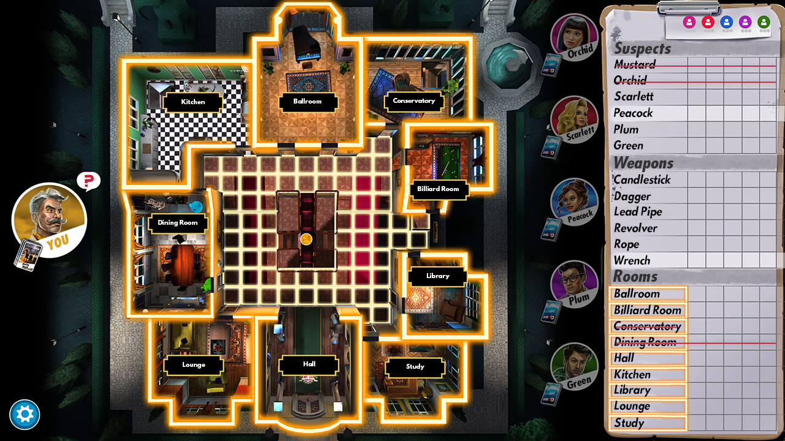

# 02-Project_Suspicion - Demo-GDD
---
## 1. Giriş

### 1.1 Özet
Proje, **Cluedo** kutu oyunundan esinlenilmiştir. Oyuncu, katilin psikolojisi ile oynayarak olay yeri, cinayet zamanı ve cinayet silahını bulmaya çalışır. 

**Oyuncu İnsiyatifi:**
- İsterse TC Anayasası'ndan madde alıntılayarak yapıcı yaklaşım
- İsterse tamamen agresif ve baskıcı sorgulama tarzı
- İsterse iyi polis rolü (İtiraf edersen ceza indirimi uygulatabilirim vb.)
- Kontrol tamamen oyuncunun elinde

**Ana Hedef:** Katilin avukatı gelmeden önce suçluyu konuşturarak cinayeti çözmek. Aksi takdirde oyuncu kaybeder.



---

## 2. Oynanış

### 2.1 Cinayet Parametreleri

Oyunda **3 ana kategori** bulunur ve her kategorinin altında **3 farklı seçenek** vardır:
- **Cinayet_Yeri** (Yer1, Yer2, Yer3)
- **Cinayet_Zamanı** (Zaman1, Zaman2, Zaman3)
- **Cinayet_Silahı** (Silah1, Silah2, Silah3)

**Oyun Başlangıcı:** Her kategoriden 1 parametre seçilir ve LLM bu 3 parametre ile hikaye oluşturur. Oyuncu bu bilgileri görmez.


**Örnek Senaryo:**  
Katil _Zaman2_'de eşyalarını toplarken _Silah1_'i buldu ve _Yer1_'e gidip cinayeti işledi.

### 2.2 Görgü Tanığı İfadesi

Seçilen parametreler dışında kalan **6 parametreden** rastgele **3 tanesi** seçilir ve LLM ile görgü tanığı ifadesi oluşturulur. Oyuncu bu ifadeyi oyun başında görebilir ve ipucu olarak kullanabilir.


**Örnek Tanık İfadesi:**  
Görgü tanığı _Zaman1_ ve _Zaman3_'te _Silah2_ ile avlanmaya çıkmış.

### 2.3 Oyuncu ve Sorgulama Mekanikleri

Oyuncu, görgü tanığı ifadesine ve katilin tepkilerine bakarak stratejik sorular sormalıdır. 

**Kısıtlamalar:**
- Sınırlı soru hakkı (avukat gelene kadar)
- Zaman baskısı altında karar verme
- Yanlış suçlamalar katili daha temkinli yapabilir

**Sorgulama Örneği:**

```
Oyuncu: "Neden burada olduğunu biliyorsun değil mi?"
Katil: "Bilmiyorum, hatırlatır mısın?" 
// Durum: Rahat, savunmaya geçmedi

Oyuncu: "Zaman3'te işlediğin cinayeti biliyorum."
Katil: "Hayır, Zaman3'te Yer2'deydim. Silah2'yi tamir ediyordum."
// Durum: Yalan söylüyor (Silah2 görgü tanığındaydı)

Oyuncu: "Yalan söylediğini biliyorum."
Katil: "Yalan söylemiyorum!"
// Durum: Stresli, savunmaya geçti
```

---

## 3. Mekanikler

### 3.1 Katil Türleri ve Zorluk Seviyeleri

MVP aşamasında **3 farklı katil karakteristiği** bulunur. Her karakteristik farklı zorluk seviyesini temsil eder:

| Katil Türü | Zorluk | Özellikler |
|------------|--------|------------|
| **Saf** | Kolay | Duygusal, kolay etkilenir, hızlı strese girer |
| **Zeki** | Orta | Mantıklı, savunma kurar, tutarlı yalanlar söyler |
| **Psikopat** | Zor | Soğukkanlı, çok zeki, empati yok, korku/suçluluk hissetmez |

**Önemli Not:** Oyuncu katil türünü göremez ve sorgulama sırasında anlayarak strateji geliştirmelidir.

**Psikopat Katil Örnek Özellikleri:**
- Soğukkanlı davranış
- Yüksek zeka seviyesi
- Empati eksikliği
- Korku ve suçluluk duygusuna karşı direnç

### 3.2 LLM Katil Entegrasyonu

Bu mekanik, oyunun özgün yapay zeka sistemini içermektedir. Sistemin detayları gizli tutulmaktadır ve bu dokümantasyonda açıklanmayacaktır.

### 3.3 Katil Yüz İfadeleri ve Fiziksel İpuçları

Katil, belirli durumlarda **küçük ipuçları** verebilir. MVP aşamasında bu ipuçları yüz ifadeleri ile sınırlıdır.

**Mevcut İpuçları (MVP):**
- Yüz ifadesi değişiklikleri
- Bakış hareketleri
- Duygusal tepkiler

**Gelecek Geliştirme Planları:**
- Terleme animasyonları
- Hızlı nefes alma efektleri
- Sigara içme isteği davranışları
- Yutkunma animasyonları
- Ses tonu değişiklikleri
- Rahatlamış bir şekilde oturma

---

## 4. Oyun Akışı

### Oyun Başlangıcı
1. Rastgele cinayet parametreleri seçilir
2. LLM hikaye oluşturur
3. Görgü tanığı ifadesi oyuncuya sunulur
4. Sorgulama başlar

### Oyun İçi
1. Oyuncu stratejik sorular sorar
2. Katil karakteristiğine göre tepki verir
3. Zaman ilerler (avukat yaklaşır)

### Oyun Sonu
- **Başarılı:** Doğru parametreleri bulma
- **Başarısız:** Avukat gelmeden çözememe veya yanlış suçlamalar ile katili rahatsız etme

---

> **Not:** Bu dokümantasyon **Ethem Emre Özkan** tarafından hazırlanmıştır ve geliştirme sürecine göre güncellenebilir.

**Dokümantasyon Versiyonu:** Demo-GDD v1.0  
**Son Güncelleme:** 1.10.2025
**Proje Durumu:** Konsept Aşaması