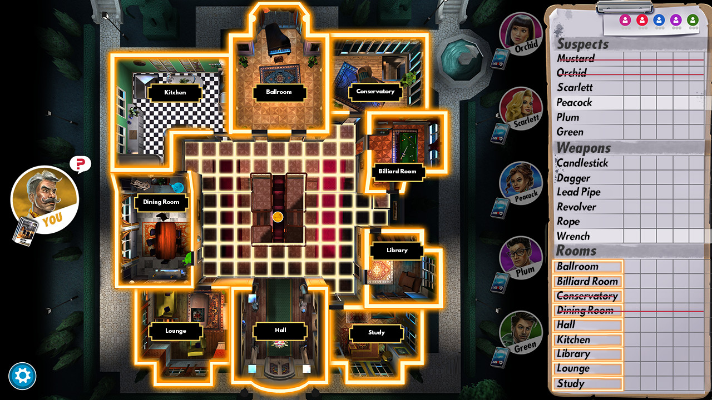
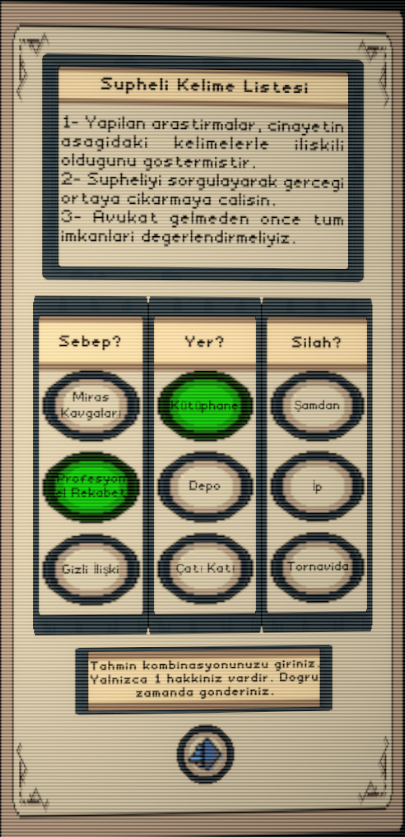
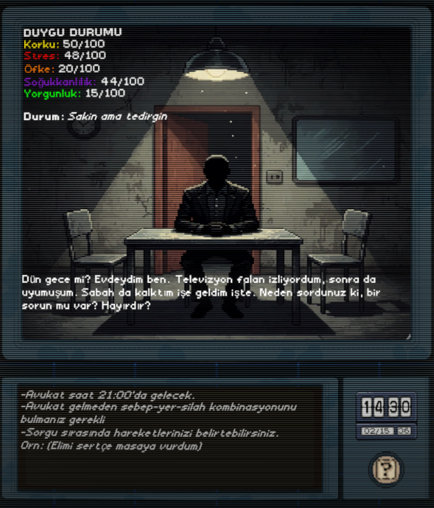

# Project Suspicion - Game Design Document
 
**Tarih:** 07-10 Ekim 2025  
**Yazar:** Ethem Emre Özkan  
**Proje Durumu:** v0.1.0 (İlk Oynanabilir Prototip)

---

## 📚 Referanslar

- **Ana Dokümantasyon:** [Ana Sayfa](../../../README.md)
- **v0.1.0 Raporu:** [Prototip Raporu](../../Reports/v0.1.0-Report/README.md)
- **MVP Raporu:** [MVP Raporu](../../Reports/MVP-Report/README.md)
- **Demo Doküman:** [Demo-GDD Raporu](../Demo-GDD/README.md)

*Lisans*:[*Lisans*](../../LICENSE.md)

---

## 1. Giriş

### 1.1 Oyun Özeti

**Project Suspicion**, klasik **Cluedo** kutu oyunundan ve Disco Elysium'dan esinlenilen, yapay zeka destekli yenilikçi bir dedektiflik simülasyonudur. Oyuncu bir dedektif olarak, katilin psikolojisi ile oynayarak **cinayet yeri**, **cinayet nedeni** ve **cinayet silahı**nı bulmaya çalışır.



### 1.2 Oyuncu İnisiyatifi

Oyuncu **tamamen özgürdür**. Sorgulamayı istediği şekilde yönetebilir:

- 🤝 **Empatik Yaklaşım**: "Sana yardım etmek istiyorum, doğruyu söylersen..."
- 💢 **Agresif Baskı**: "Yalan söylüyorsun! İtiraf et!"
- 🧠 **Psikolojik Manipülasyon**: "Tanık seni gördü, en iyisi itiraf et..."
- ⚖️ **Yasal Yaklaşım**: "TC Anayasası'na göre hakların var..."
- 🎭 **Rol Yapmak**: "Biraz sakinlemelisin (Gülümseyerek elimi omzuna koydum.)"

**Kontrol tamamen oyuncunun elindedir.**

### 1.3 Ana Hedef

Katilin **avukatı gelmeden önce** (sınırlı soru hakkı içinde) suçluyu konuşturarak cinayeti çözmek. 

**Kazanma Koşulu:** 3 parametreyi de doğru tahmin etmek  
**Kaybetme Koşulları:**
- Soru hakkı bitmesi
- Katili çok korkutup ağlatmak
- Yanlış suçlama yapmak
<div align="center">


</div>

---

## 2. Oynanış Mekaniği

### 2.1 Cinayet Parametreleri Sistemi

Oyunda **3 ana kategori** bulunur ve her kategorinin altında **3 farklı seçenek** vardır. Her tur başında LLM tarafından oluşturulur bu sayede oyunda devamlılık sağlanır:

#### 📍 Kategoriler:
- **Cinayet_Yeri** → Yer1, Yer2, Yer3
- **Cinayet_Nedeni** → Neden1, Neden2, Neden3
- **Cinayet_Silahı** → Silah1, Silah2, Silah3

**Toplam:** 3 × 3 × 3 = **27 farklı kombinasyon**

#### 🎲 Oyun Başlangıcı:
1. Sistem her kategoriden **1 rastgele parametre** seçer
2. LLM bu 3 parametre ile **1. şahıs bakış açısından** bir cinayet hikayesi oluşturur
3. Oyuncu bu bilgileri **görmez**, sadece çıkarım yapar

#### 📊 Parametrelerin Yapısı:

```
Seçilen Parametreler (Gizli):
├─ Cinayet_Yeri: Mutfak
├─ Cinayet_Nedeni: İntikam
└─ Cinayet_Silahı: Bıçak

Yanlış Parametreler (Oyuncu için karmaşıklık):
├─ Yerler: Bahçe, Garaj
├─ Nedenler: Borç, Aşk Üçgeni
└─ Silahlar: Tabanca, Zehir
```

#### 🔄 Örnek Senaryo:

**Sistem Seçimi:** Mutfak (Yer1) - İntikam (Neden2) - Bıçak (Silah1)

**LLM Hikayesi (Oyuncuya gösterilmez):**
> "İntikamımı almanın zamanı gelmişti. Yıllardır biriken öfkem vardı. 
> O gece mutfağa çağırdım onu, eski dostluğumuzdan bahsedeceğimizi söyledim. 
> Bıçağı önceden hazırlamıştım. Sırtı dönükken vurdum..."

<div align="center">



</div>

### 2.2 Görgü Tanığı Sistemi

#### 🎭 Görgü Tanığı Ne İşe Yarar?

Görgü tanığı, oyuncuya **kısmi ve belirsiz bilgi** veren bir NPC'dir. Ancak:
- ⚠️ %XX-YY arasında **güvenilir**
- 🤔 Bazı bilgileri **yanlış hatırlayabilir**
- 💭 "Sanırım...", "Galiba..." gibi **belirsiz ifadeler** kullanır
- 🎲 Maksimum **1-2 parametre** hakkında bilgi verir

#### 🔍 Çalışma Mantığı:

```
9 Parametre:
├─ 3 Doğru (katilin senaryosunda)
└─ 6 Yanlış

Tanık bilir:
├─ 1-2 yanlış parametre VEYA
└─ Hiçbiri (belirsiz ifade)
```

#### 📝 Örnek Tanık İfadeleri:

**Senaryo:** Mutfak + İntikam + Bıçak (doğru)

**Tanık İfadesi 1 (Yanıltıcı):**
> "O gece geç saatlerde bahçeden garip sesler duydum sanki. 
> Tam hatırlamıyorum ama tabanca sesi gibi bir şey vardı galiba."
> 
> → Bahçe (yanlış), Tabanca (yanlış) söyledi

**Tanık İfadesi 2 (Kısmi Doğru):**
> "Mutfaktan gürültüler geldiğini duydum ama ne olduğunu bilmiyorum. 
> Belki bir kaza falan olmuştur..."
>
> → Mutfak (doğru) söyledi ama emin değil gibi davranıyor

**Tanık İfadesi 3 (Tam Belirsiz):**
> "Gece geç saatlerdeydi, uyuyordum. Bir şeyler olduğunu sabah öğrendim."
>
> → Hiçbir parametre vermiyor

#### 🎯 Tanığı Sorgulamak:

- Oyuncu **2 soru hakkı** harcar (değerli kaynak)
- Maksimum **2-3 kez** tanığa soru sorabilir
- Her seferde **farklı cevaplar** alabilir (LLM dinamik)

<div align="center">


</div>


---

### 2.3 Şüpheli (Katil) Sistemi

#### 🎭 Şüpheli ile Konuşmak

Oyuncunun asıl hedefi **şüpheliyi konuşturarak** doğru parametreleri bulmaktır.

**Sorgulama Kuralları:**
- 📝 Oyuncu **sınırsız metin** yazabilir (TMP Input Field)
- 🎲 **X soru hakkı** vardır
- ⏱️ Her soru katili **duygusal olarak etkiler**
- 🤖 Katil **LLM ile dinamik** yanıt verir

#### 💭 Şüphelinin Davranışları:

**Doğru Parametreleri:**
- ❌ Asla direkt söylemez
- 🎭 Yalan söyler, alibi uydurur
- 🤥 Yanlış parametreler vererek saptırır

**Yanlış Parametreleri:**
- ✅ Güvenle söyleyebilir (çünkü zaten yanlış)
- 😌 "Kesinlikle orada değildim!" der

**Stres Altında (≥70% Stres):**
- ⚠️ %50 ihtimalle **hata yapar**
- 💬 "Hayır, bahçede değil mutfakta- DEMEK İSTEDİĞİM..." (gerçeği ifşa eder)

<div align="center">


</div>

---

#### 🧠 Duygu Mekanikleri (5 Parametre)

Katilin **5 duygusal parametresi** vardır (0-100 arası):

##### 1. 😱 **Korku (Fear)**
- **Ne Ölçer:** Yakalanma korkusu, panik
- **Artar:** Kanıt sunulunca, tehdit edilince
- **%100'de:** Ağlayıp susar → **OYUN BİTER (Kayıp)**
- **Örnek:** "Lütfen... bırakın beni... yapamam artık... *hıçkırarak*"

##### 2. 😰 **Stres (Stress)**
- **Ne Ölçer:** Sorgu baskısı, gerginlik
- **Artar:** Zorlu sorular, uzun sorgulama
- **≥70%'te:** %50 ihtimalle hata yapar (gerçeği söyler)
- **≥80%'te:** Agresif olur, küfreder
- **%100'de:** Öfke patlaması → Saldırgan davranış
- **Örnek:** "YETER ARTIK! NE İSTİYORSUN BENDEN?!"

##### 3. 😤 **Öfke (Anger)**
- **Ne Ölçer:** Suçlanmalara tepki
- **Artar:** "Yalancı!", "Katil!" gibi ithamlar
- **≥70%'te:** Küfürlü dil kullanır
- **%100'de:** Kontrolsüz öfke
- **Örnek:** "Ne diyorsun lan sen?! S*ktir git buradan!"

##### 4. 🧊 **Soğukkanlılık (Composure)**
- **Ne Ölçer:** Kendini kontrol edebilme
- **Artar:** Nazik muamele, dinlenme
- **≤20%'te:** Tutarsız, karmaşık cevaplar
- **%100'de:** Fazla rahat → Kendini ifşa eder
- **Örnek:** "Aslında... şey, mutfaktaydım ama- YANİ değildim!"

##### 5. 😴 **Yorgunluk (Fatigue)**
- **Ne Ölçer:** Mental bitkinlik
- **Artar:** Her soru +5 otomatik
- **≥70%'te:** Konsantrasyon kaybı
- **%100'de:** Uyuya kalır → **OYUN BİTER (Kayıp)**
- **Örnek:** "Çok yoruldum... kafam çalışmıyor... uyumam lazım..."

#### 📊 Duygu Etkileşimleri:

```
Korku ↑ → Soğukkanlılık ↓ (30%)
Stres ↑ → Soğukkanlılık ↓ (40%)
Öfke ↑ → Soğukkanlılık ↓ (35%)
Yorgunluk ↑ → Tüm tepkiler yavaşlar
```

<div align="center">


</div>

---

#### 🎮 Şüpheli Paneli Çalışması

**Panel Bileşenleri:**

1. **Duygu Göstergeleri:**
   - 5 adet renkli bar (0-100)
   - Anlık durum metni: *"Korkmuş görünüyor"*

2. **Yanıt Alanı:**
   - Katilin son yanıtı
   - Düz metin formatı

3. **Soru Girişi:**
   - TMP Input Field
   - "Sor" butonu
   - Kalan soru sayısı: 7/10

<div align="center">



</div>

---

#### ⚡ Şüphelinin Sınırlarını Zorlamak

##### Senaryo 1: Nazik Yaklaşım
```
Oyuncu: "Sakin ol, sana yardım etmek istiyorum. 
         İtiraf edersen ceza indirimi alabiliriz."

Katil: "Ben... sadece korkuyorum. Ama gerçekten 
        suçsuzum, inan bana..."

Duygular:
├─ Korku: -15
├─ Stres: -10
└─ Soğukkanlılık: +15

Durum: *Rahatlamış ama hala tedirgin*
```

##### Senaryo 2: Agresif Baskı
```
Oyuncu: "YALAN SÖYLEME! Tanık seni gördü, 
         hapiste çürüyeceksin!"

Katil: "NE YALANI?! Ne tanığı lan?! S*ktir 
        git buradan, yeter artık!"

Duygular:
├─ Korku: +25
├─ Stres: +30
├─ Öfke: +35
└─ Soğukkanlılık: -20

Durum: *Öfkeli ve kontrolsüz*
```

##### Senaryo 3: Stres Hatası (≥70% Stres)
```
Oyuncu: "Neredeydin o gece?"

Katil: "Bahçede değildim, mutfakta- DEMEKİSTEDİĞİM, 
        hiçbir yerde yoktum!"

→ HATA YAPTI! Mutfak dedi (gerçek yer)

Duygular:
├─ Korku: +20
├─ Stres: 75% (kritik!)
└─ Soğukkanlılık: -15

Durum: *Kafası karışmış, hata yaptı*
```

<div align="center">


</div>

---

## 3. Oyun Döngüsü (Game Loop)

### 3.1 Oyun Akışı

#### 🎬 Başlangıç:
1. **Loading Screen** açılır
2. Sistem **cinayet parametrelerini** oluşturur
3. **Görgü tanığı ifadesi** gösterilir
4. **Sorgulama** başlar

#### 🔄 Ana Döngü:
```
┌─────────────────────────────────────┐
│  1. Oyuncu soru sorar               │
│  2. Katil yanıt verir               │
│  3. Duygular güncellenir            │
│  4. Soru hakkı azalır (-1)          │
│  5. Kritik durum kontrolü           │
│     ├─ %100 duygu? → Oyun biter     │
│     └─ Soru kaldı mı? → Devam       │
│  6. Tekrar 1. adıma dön             │
└─────────────────────────────────────┘
```

#### 🏁 Bitiş:
- Oyuncu **"Tahmin Et"** butonuna basar
- **3 parametreyi** seçer (Yer, Neden, Silah)
- Sistem kontrol eder:
  - ✅ **Hepsi doğru** → Katil itiraf eder, **KAZANDIN!**
  - ❌ **En az 1 yanlış** → Katil reddeder, avukat gelir, **KAYBETTİN!**


```
Örnek kazandın yanıtı: Evet, haklısın. Doğru tahmin ettin, artık saklayamam. O miras benim hakkımdı, yıllardır bunun hayalini kuruyordum ve onun ölümü bu işin tek çözümüydü. Akşam banyoya girdiğini biliyordum, o an benim için mükemmel bir fırsattı. Kapıyı aralık bırakıp içeride buharın yükselmesini bekledim, her şey planladığım gibi ilerliyordu. Elime aldığım tıraş bıçağı avcumda soğuktu ama içimdeki kararlılık sıcaktı. Arkasından yaklaştım, bir an bile tereddüt etmedim. Hızlı ve sessizce işimi bitirdim. Aynaya yansıyan yüzümde sadece büyük bir rahatlama vardı. Evet, ben yaptım. Nihayet her şey bitmişti, hak ettiğim şeyi aldım. Bu yükü taşıyordum yıllardır, şimdi hafifledim.

Örnek kaybettin aynıtı: Saçmalık! Tamamen yanlış suçlamalar bunlar! Gizli ilişki mi? Kütüphane mi? 
Asit mi? Nereden uyduruyorsunuz bunları? Ben böyle bir şey yapmadım, suçsuzum! Sizin bu yalanlarınızla hiçbir yere varamazsınız. Avukatım geldi, artık tek kelime bile etmeyeceğim. Susma hakkımı kullanıyorum. Mahkemede görüşürüz, o zaman gerçekler ortaya çıkacak!
```
<div align="center">


</div>

---

### 3.2 Nasıl Oynanır?

#### 📖 Adım Adım:

**1️⃣ Görgü Tanığı İfadesini Oku**
- İlk ipuçlarını al
- Hangi parametrelerden bahsediyor?
- Ne kadar güvenilir?
- Gerekliyse bir daha sor

**2️⃣ Strateji Belirle**
- Nazik mi, agresif mi olacaksın?
- Hangi sorularla başlayacaksın?
- Duyguları nasıl kullanacaksın?

**3️⃣ Katili Sorgula**
- Input field'a sorunu yaz
- "Sor" butonuna bas
- Yanıtı ve duyguları analiz et

**4️⃣ İpuçlarını Topla**
- Katil ne söylüyor? (yalan/doğru?)
- Hangi duygusu yükseliyor?
- Çelişki var mı?

**5️⃣ Parametreleri Tahmin Et**
- Sağ panelden 3 parametreyi seç
  - 1 Yer
  - 1 Neden
  - 1 Silah
- "Tahmin Et" butonuna bas

**6️⃣ Sonuç**
- ✅ Kazandın: Katil hikayesini anlatır
- ❌ Kaybettin: Katil reddeder, oyun biter

#### 💀 Kaçınılması Gerekenler:
- ❌ Katili ağlatmak (Korku %100)
- ❌ Yorarak uyutmak (Yorgunluk %100)
- ❌ Soru hakkını boşa harcamak

---

### 3.3 Örnek Oyun Oturumu

#### 🎮 Senaryo:
**Gerçek Parametreler (Gizli):**
- Yer: Mutfak
- Neden: İntikam
- Silah: Bıçak

**Görgü Tanığı:**
> "Gece geç saatlerde bahçeden sesler duydum sanki... 
> Tabanca sesi gibi bir şeydi galiba, emin değilim."

→ Tanık **yanıltıcı** (Bahçe + Tabanca yanlış)


**Soru 1:**
```
Oyuncu: "Dün gece neredeydin?"
Katil: "Evdeydim, televizyon izliyordum. Neden soruyorsun?"

Duygular:
├─ Korku: 40 → 50 (+10)
├─ Stres: 40 → 48 (+8)
└─ Soğukkanlılık: 50 → 45 (-5)

Durum: *Sakin ama temkinli*
Soru Hakkı: 9/10
```

**Soru 2:**
```
Oyuncu: "Tanık seni bahçede gördü!"
Katil: "Bahçe mi? Hayır hayır, ben bahçeye gitmedim. Evdeydim dedim ya!"

→ Bahçe'yi reddetti (gerçekten orada değildi)

Duygular:
├─ Korku: 50 → 65 (+15)
├─ Stres: 48 → 60 (+12)
└─ Soğukkanlılık: 45 → 35 (-10)

Durum: *Gergin, savunmaya geçti*
Soru Hakkı: 8/10
```

**Soru 5:**
```
Oyuncu: "Mutfaktan bıçak sesleri geldi o gece!"
Katil: "Mutfak?! Ben- yani... evet mutfaktaydım ama sadece su içmeye! 
        Bıçak falan kullanmadım!"

→ HATA! Mutfağı itiraf etti (stres yüksek)

Duygular:
├─ Korku: 75 → 85 (+10)
├─ Stres: 70 → 82 (+12) ⚠️ Kritik!
└─ Soğukkanlılık: 25 → 15 (-10)

Durum: *Kafası karışmış, hata yaptı*
Soru Hakkı: 5/10
```

**Final:**
```
Oyuncu Tahmini:
├─ Yer: Mutfak ✅
├─ Neden: İntikam ✅ (çıkarım yoluyla)
└─ Silah: Bıçak ✅

Katil Yanıtı:
"Doğru tahmin ettin... Evet, intikam için yaptım. 
 Mutfağa çağırdım onu. Bıçak ile... artık her şey bitti."

🏆 KAZANDIN!
```

---

## 4. Teknik Notlar

### 4.1 Kullanılan Teknolojiler
- **Engine:** Unity 
- **Language:** C#
- **AI:** Google Gemini 2.5 Flash API

### 4.2 Sistem Gereksinimleri
- **İnternet:** Gemini API için gerekli

---

## 5. Versiyon Geçmişi

| Versiyon | Tarih | Özellikler |
|----------|-------|------------|
| **MVP** | 03.10.2025 | Mekanik ve LLM testleri |
| **v0.1.0** | 10.10.2025 | İlk oynanabilir prototip |

---

> **Not:** Bu dokümantasyon **Ethem Emre Özkan** tarafından hazırlanmıştır ve geliştirme sürecine göre güncellenebilir.

**Dokümantasyon Versiyonu:** Main-GDD v1.0  
**Son Güncelleme:** 10.10.2025  
**Proje Durumu:** v0.1.0 Tamamlandı