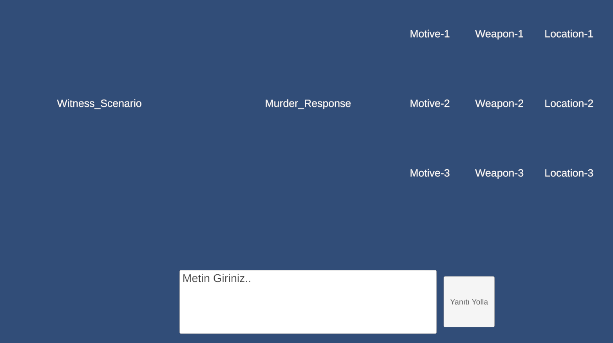

# MVP Final Report - 02-Unity-Project_Suspicion

---

## 📅 Geliştirme Süreci

**Tarih Aralığı:** 02.10.2025 - 03.10.2025  
**Süre:** 2 Gün  
**Aşama:** Konsept → MVP

Proje, konsept aşamasından MVP (Minimum Viable Product) seviyesine kadar başarıyla geliştirildi.

---

## 📖 Referans Dokümanlar

**Proje Konsept Dokümanı:**  
[Demo-GDD](../../GDD/Demo-GDD/README.md)

---

## ✅ MVP Başarı Kriterleri

### Hedeflenen Mekanikler
- [x] Temel LLM entegrasyonu çalışır durumda
- [x] Cinayet parametreleri rastgele seçim sistemi
- [x] Görgü tanığı ifadesi oluşturma
- [x] Sorgulama mekanikleri implementasyonu
- [x] Katil karakteristik sistemi (Zeki)

### Teknik Altyapı
- [x] Proje mimari tasarımı temel seviyede
- [x] LLM-Game iletişim protokolü
- [x] Text-based UI sistemi

---

## 💡 Çıkarımlar ve Değerlendirme

### Başarılar
Proje, konsept dokümanında bulunan **potansiyeli gerçekleştirebilecek seviyeye** ulaştı. Temel mekanikler çalışır durumda ve oyun fikri doğrulandı.

### Teknik Zorluklar
- LLM response süreleri optimizasyon gerektiriyor
- Chat geçmişi yönetimi iyileştirilmeli
- Canvas rendering performansı izlenmeli

### Görseller
- Editör görünümü

- Runtime görünümü

> ⚠️ **Not:** MVP seviyesi olduğu için herhangi bir **Asset kullanılmamıştır**. 

---

## 🔧 Prototip Aşaması İçin Yapılması Gerekenler

### 1. Görselleştirme
- [ ] UI tasarımı ve asset oluşturma
- [ ] Karakter sprite'ları ve animasyonlar
- [ ] Ortam tasarımı (sorgulama odası)
- [ ] Yüz ifadesi sisteminin görselleştirilmesi

### 2. Dokümantasyon
- [ ] **Proje Mimari Dokümanı** hazırlanması
- [ ] Teknik sistem akış şemaları
- [ ] Code documentation güncellenmesi
- [ ] API reference dokümanları

### 3. LLM Optimizasyonu
- [ ] **Duygular** ve **chat geçmişi** ayrı yönetim sistemi
- [ ] Daha kısa ve optimize prompt yapısı
- [ ] Response cache mekanizması
- [ ] Hızlı LLM-Game iletişim protokolü

### 4. Performance Optimizasyonu
- [ ] **Canvas optimizasyonları** (text-based odaklı)
- [ ] Text rendering performans iyileştirmesi
- [ ] Load time optimizasyonları

### 5. Oynanış İyileştirmeleri
- [ ] Tutorial sistemi
- [ ] Feedback mekanizmaları (ses, görsel efektler)

---

## 📊 Proje Durumu Özeti

| Kategori | Durum | Tamamlanma |
|----------|-------|------------|
| **Core Mechanics** | ✅ Tamamlandı | %100 |
| **LLM Integration** | ✅ Çalışıyor | %80 |
| **UI/UX** | 🚧 Prototype | %30 |
| **Optimization** | ⏳ Beklemede | %20 |
| **Documentation** | 📝 Devam Ediyor | %60 |

---

## 🔍 Teknik Notlar

### Build Durumu
> ⚠️ **Not:** Bu versiyon için herhangi bir **build alınmamıştır**. 

**Sebep:** MVP aşaması, hedeflenen mekaniklerin çalışma durumlarının test edilmesi ve mimari tasarım için ön ayak oluşturulması amacıyla yapılmıştır.

### Versiyon Bilgisi
- **Proje Adı:** 02-Unity-Project_Suspicion-MVP
- **Versiyon:** v0.1.0-mvp
- **Platform:** Unity Editor Only
---

## 📝 Geliştirici Notları

### Ne Öğrendim?
- LLM entegrasyonu Unity'de nasıl yapılır
- Text-based oyunlar için UI optimizasyonu
- Async API call yönetimi
- Prompt engineering temel prensipleri

### Nerede Zorlandım?
- LLM response sürelerinin tahmin edilememesi
- Chat history karmaşıklığı
- State machine ve LLM decision tree entegrasyonu

### Gelecek İçin İyileştirmeler
- Daha modüler LLM sistem mimarisi
- Daha stabil method ve class mimarisi
- Folder mimarisi
---

> **Hazırlayan:** Ethem Emre Özkan  
> **Tarih:** 03.10.2025  
> **Durum:** ✅ MVP Tamamlandı