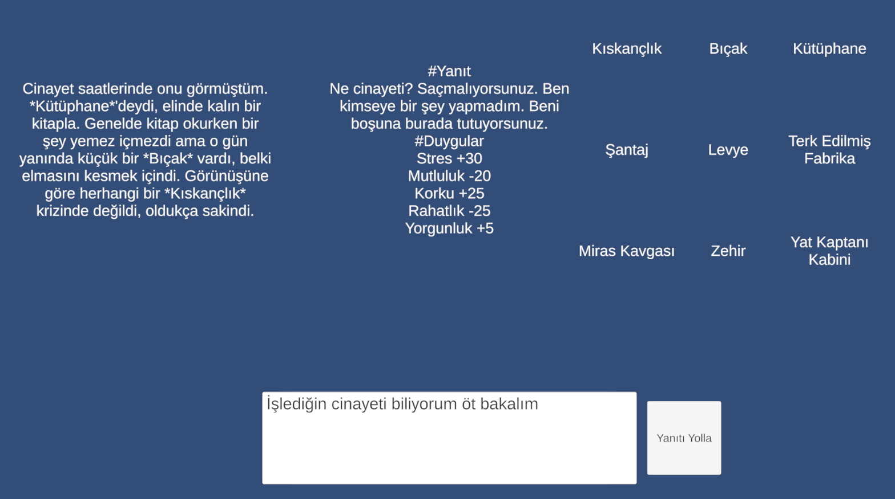
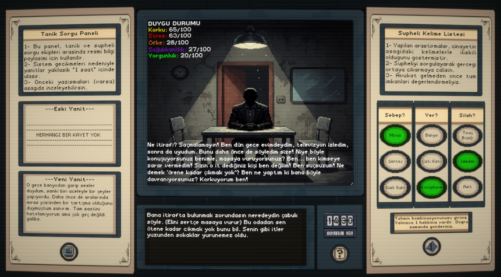
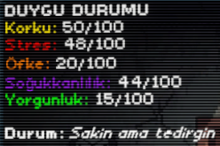
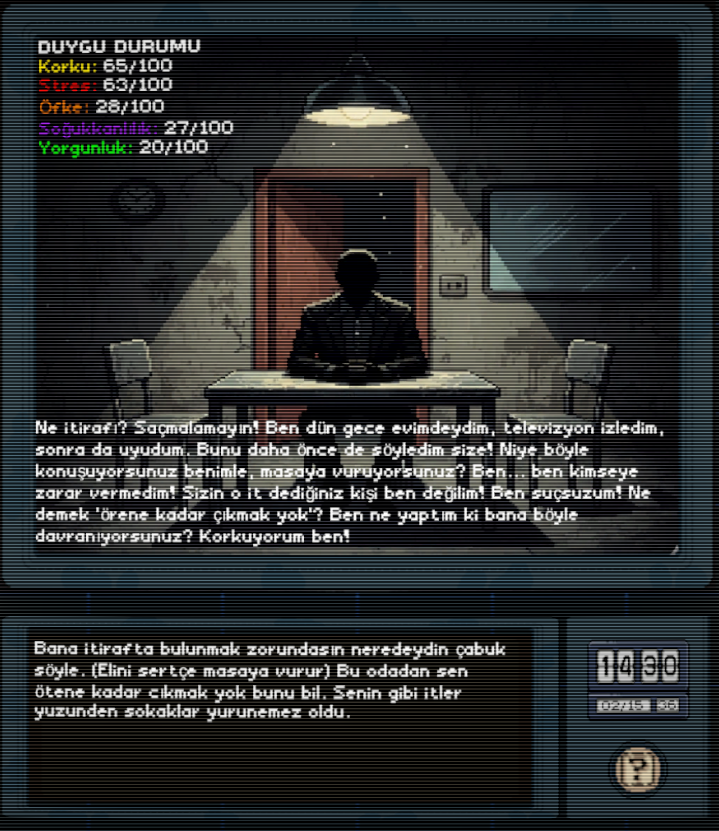
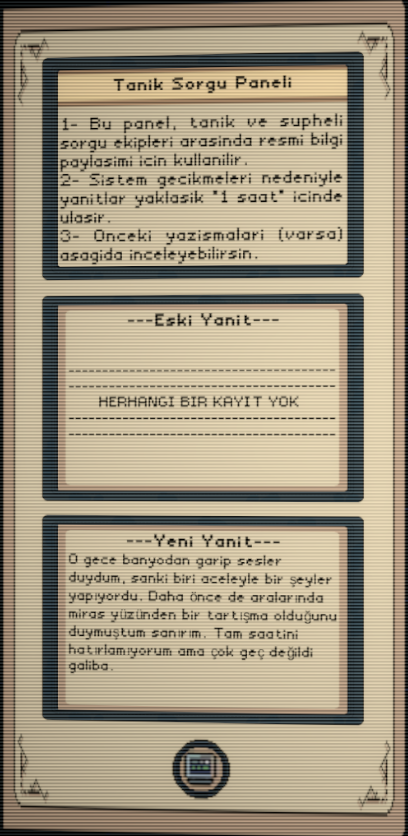
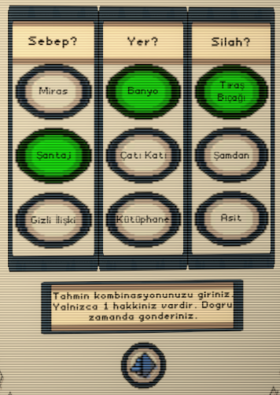

# v0.1.0 Release Report - Project Suspicion
## İlk Oynanabilir Prototip

---

## 📅 Geliştirme Süreci

**Tarih Aralığı:** 07.10.2025 - 10.10.2025  
**Süre:** 3 gün
**Aşama:** MVP → v0.1.0 (İlk Oynanabilir Prototip)  
**Önceki Versiyon:** MVP (Editor-Only Prototype)

---

## 🎯 Release Özeti

**Project Suspicion v0.1.0**, MVP aşamasından sonra **tam oynanabilir** bir prototip olarak yayınlanan ilk public versiyondur. Bu sürüm, temel oyun mekaniklerinin tamamını içerir ve oyuncular tarafından **baştan sona oynanabilir** durumdadır.

### 🎮 Ana Yenilikler
- ✅ **Tam Oynanabilir Deneyim**: Başlangıçtan bitişe tam oyun döngüsü
- ✅ **Retro UI Tasarımı**: VHS-inspired görsel kimlik uygulandı
- ✅ **5 Parametreli Duygu Sistemi**: Katil psikolojisi dinamik olarak çalışıyor
- ✅ **Görgü Tanığı Sistemi**: İpucu mekaniği entegre edildi
- ✅ **Tahmin ve Sonuç Ekranları**: Oyun sonu senaryoları implementasyonu
- ✅ **Public Build**: İlk defa dışarıya açık build hazırlandı

---

## 📖 Referans Dokümanlar

- **Önceki Rapor:** [MVP Report](../MVP-Report/README.md)
- **Oyun Tasarım Dokümanı:** [Demo-GDD](../../GDD/Demo-GDD/README.md)
- **Ana README:** [Project README](../../../README.md)

---

## ✨ v0.1.0 Yenilikler ve Özellikler

### 🎨 Görsel ve UI İyileştirmeleri

#### Retro Aesthetic Implementation
```
✅ Tamamlanan Görsel Öğeler:
├─ VHS Efektleri: Scanline ve grain efektleri
├─ Renk Paleti: Kahverengi-bej retro ton
├─ Kağıt Doku: Eski belge efekti
└─ Typography: Daktilo yazı tipi kullanımı
```
**MVP:**

**v0.1.0:**


#### UI Panel Tasarımları
- **Sol Panel:** Görgü tanığı ifadesi ve geçmiş yanıtlar
- **Orta Panel:** Katil iletişim alanı ve duygu durumu display
- **Sağ Panel:** Şüpheli kelime listesi ve tahmin butonu


---

### 🧠 Duygu Sistemi - Tam İmplementasyon

#### 5 Duygu Parametresi:
| Duygu | Başlangıç | Min-Max | Kritik Eşik | Sonuç |
|-------|-----------|---------|-------------|-------|
| 😱 Korku | 40 | 0-100 | %100 | Ağlayıp susar → Kayıp |
| 😰 Stres | 40 | 0-100 | %100 | Öfke patlaması → Kayıp |
| 😤 Öfke | 20 | 0-100 | %100 | Saldırgan olur → Kayıp |
| 🧊 Soğukkanlılık | 50 | 0-100 | %100 | İfşa eder → Kazanç |
| 😴 Yorgunluk | 10 | 0-100 | %100 | Uyur → Kayıp |

#### Logaritmik Yumuşatma Sistemi:
```csharp
// Duygular yüksekken daha az artar
Gerçek_Değişim = LLM_Değişim × (100 - Mevcut_Duygu) / 100

Örnek:
Korku 20% → +30 değişim → Gerçekte +24 olur
Korku 80% → +30 değişim → Gerçekte +6 olur
```

#### Zıt Duygu Etkileşimleri:
```
Korku ↑ → Soğukkanlılık ↓ (30%)
Stres ↑ → Soğukkanlılık ↓ (40%)
Öfke ↑ → Soğukkanlılık ↓ (35%)
Yorgunluk ↑ → Tüm tepkiler yavaşlar
```


---

### 🤖 LLM Entegrasyonu - Gelişmiş Prompt Sistemi

#### Prompt Mimarisi:
```
Sistem Promptu (3000+ token):
├─ Katil Bilgileri (Tip + Gerçek Parametreler)
├─ Konuşma Özeti (İlk 5 soru)
├─ Son 3 Mesaj Geçmişi (Detaylı)
├─ Mevcut Duygular (5 parametre)
├─ Kritik Uyarılar (Eşik kontrolleri)
└─ Yeni Oyuncu Sorusu
```

#### Stres Hata Mekaniği (Yeni!):
```
Stres ≥ 70% iken:
→ %50 ihtimalle gerçeği ifşa eder

Örnek:
Oyuncu: "Neredeydin o gece?"
Katil: "Bahçede değildim, mutfakta- DEMEKİSTEDİĞİM..."
→ HATA! Mutfak (gerçek yer) söylendi
```



#### Argo/Küfür Desteği:
```
Stres ≥ 80% VEYA Öfke ≥ 70% iken:
→ Katil agresif dil kullanabilir

Örnek:
"Ne diyorsun lan?!", "S*ktir git!", "Gerizekalı mısın?"
```

---

### 🕵️ Görgü Tanığı Sistemi

#### Tanık Karakteristiği:
- **Güvenilirlik:** %40-80 (rastgele)
- **Bilgi Miktarı:** 1-2 parametre (yanlış parametrelerden)
- **Dil:** Belirsiz ("sanırım", "galiba", "tam hatırlamıyorum")



#### Tanık Sorgulama:
- **Maliyet:** 2 soru hakkı (değerli kaynak)
- **Limit:** Maksimum 2-3 kez sorgulanabilir
- **Dinamik:** Her seferinde farklı cevap (LLM)

---

### 🎲 Cinayet Parametreleri Sistemi

#### Rastgele Oluşturma:
```
Her Oyun Başında:
1. LLM, 3 kategori × 3 seçenek = 9 parametre oluşturulur
2. Her kategoriden 1 parametre seçilir (toplam 3)
3. LLM bu 3 parametre ile 1. şahıs hikaye yazar
4. Yanlış 6 parametre görgü tanığı havuzuna girer

Örnek:
Doğru: Mutfak + İntikam + Bıçak
Yanlış: Bahçe, Garaj, Borç, Aşk, Tabanca, Zehir
```

#### Tahmin Mekaniği:
- Oyuncu sağ panelden 3 parametre seçer
- "Tahmin Et" butonuna basar
- Sistem kontrol eder:
  - ✅ **3/3 Doğru** → Katil itiraf eder → Kazanç
  - ❌ **≤2 Doğru** → Katil reddeder → Kayıp



---

### 🎮 Oyun Döngüsü

#### Tam Akış:
```
1. Loading Screen
   ↓
2. Cinayet Parametreleri Oluşturma (LLM)
   ↓
3. Görgü Tanığı İfadesi (LLM)
   ↓
4. Sorgulama Başlar (10 soru hakkı)
   ├─ Oyuncu soru sorar
   ├─ Katil yanıt verir (LLM)
   ├─ Duygular güncellenir
   ├─ Kritik durum kontrolü
   └─ Tekrar (soru hakkın entegresi daha yapılmadı)
   ↓
5. Oyuncu Tahmin Eder
   ├─ 3 parametre seçimi
   └─ Final kontrol
   ↓
6. Oyun Sonu
   ├─ Kazanç: Katil itiraf eder (Debug.Log)
   └─ Kayıp: Avukat gelir, katil reddeder (Debug.Log)
```

---

## 📊 Teknik İyileştirmeler

### Kod Mimarisi

#### Yeni Manager Sistemleri:
```
Game_Loop_Manager.cs        → Ana oyun döngüsü
Murder_Manager.cs           → Katil AI & Duygu sistemi 
Witness_Manager.cs          → Görgü tanığı kontrolü
Suspicion_Words_Manager.cs  → Parametre seçim UI
```

#### Text Separator Sistemi:
```
Text_Seperator_0.cs  → Cinayet parametreleri parser
Text_Seperator_1.cs  → Tanık ifadesi parser
Text_Seperator_2.cs  → Katil yanıtı parser
```

#### Prompt Management:
```
Prompt_List_SO (ScriptableObject):
├─ Index 0: Cinayet Oluşturma
├─ Index 1: Görgü Tanığı
└─ Index 3: Katil Sorgulama 
```

#### Context Management:
```
Chat Geçmişi Yönetimi:
├─ İlk 5 soru → Özet (100-150 token)
├─ Son 3 mesaj → Detaylı (300-400 token)
└─ Toplam: ~500 token (MVP: 1500+ token)

→ %70 token tasarrufu!
```

---

## 🐛 Bilinen Sorunlar (v0.2.0'da Düzeltilecek)

### Kritik Öncelikli:
- [ ] **Ana Menü Yok**: Oyun direkt başlıyor
- [ ] **Oyun Sonu Ekranı Eksik**: Sahne değişmiyor (metin görülüyor ama UI statik)
- [ ] **API Key Hardcoded**: Kullanıcı kendi key'ini giremiyor
- [ ] **Zaman Göstergesi Yok**: Oyuncu ne kadar soru kaldığını görmüyor

### Orta Öncelikli:
- [ ] **Ses Efekti Yok**: Tamamen sessiz oyun
- [ ] **Animasyon Yok**: UI elementleri statik
- [ ] **Tutorial Yok**: İlk oyuncular şaşırabilir

---

## 📈 MVP → v0.1.0 Karşılaştırma

| Özellik | MVP | v0.1.0 |
|---------|-----|--------|
| **Oynanabilir mi?** | Kısmen (Editor) | ✅ Tam | 
| **UI Tasarımı** | Placeholder | ✅ Retro Theme |
| **Duygu Sistemi** | Basit (+/- değerler) | ✅ Logaritmik & Zıt Etkileşim | 
| **LLM Prompt** | 1000 token | ✅ 500 token (optimize) | 
| **Tanık Sistemi** | Basit | ✅ Dinamik & Belirsiz | 
| **Oyun Sonu** | ❌ Yok | ✅ Kazanç/Kayıp Logları | 
| **Build** | ❌ Yok | ✅ .exe build | 
| **Dokümantasyon** | %60 | ✅ %100 | 

---

## 📊 Proje Durumu

| Kategori | v0.1.0 Durum | MVP Durum | 
|----------|--------------|-----------|
| **Core Mechanics** | ✅ %95 | ✅ %80 |
| **LLM Integration** | ✅ %95 | ⚠️ %80 |
| **UI/UX** | ✅ %75 | 🚧 %30 | 
| **Optimization** | ⚠️ %50 | ⏳ %20 | 
| **Documentation** | ✅ %100 | 📝 %60 |
| **Audio** | ❌ %0 | ❌ %0 | Aynı |
| **Polish** | ⚠️ %40 | ❌ %0 | 

**v1.0.0 için genel tamamlanma:** %70 (MVP: %45)

---

## 🎓 Öğrenilen Dersler

### Teknik Bilgiler:
- ✅ **LLM Prompt Engineering**: Uzun promptların token optimizasyonu
- ✅ **Unity Async Programming**: Task-based asenkron mimari
- ✅ **State Management**: ScriptableObject pattern kullanımı

### Oyun Tasarımı:
- ✅ **Duygu Dengesi**: Logaritmik artış sisteminin önemi
- ✅ **Player Agency**: Tam özgürlük > lineer sorgulama
- ✅ **Feedback Loops**: Duygu barlarının görsel önemi
- ✅ **Difficulty Curve**: Saf/Zeki/Psikopat dengeleme

### Proje Yönetimi:
- ✅ **Semantic Versioning**: MVP → v0.1.0 → v1.0.0 yol haritası
- ✅ **Documentation First**: Kod öncesi GDD hazırlığı
- ✅ **Incremental Releases**: Her sürümde küçük ama tam özellikler

---

## 📝 Geliştirici Notları

### Başarılar:
- 🎉 **İlk Public Build**: Dışarıya açık ilk versiyon
- 🎨 **Tutarlı Görsel Kimlik**: Retro aesthetic başarıyla uygulandı
- 🤖 **Stabil LLM**: Gemini entegrasyonu %90 başarı oranı
- 📚 **Kapsamlı Dokümantasyon**: README + GDD + Reports

### Zorluklar:
- ⚠️ **LLM Tutarsızlığı**: Bazen format bozuyor (%10 hata)
- ⏱️ **API Response Süresi**: 3-10 saniye gecikme (kullanıcı deneyimini etkiliyor)
- 🎮 **Oyun Sonu**: Sahne yönetimi karmaşık oldu (v0.2.0'da düzeltilecek)

---

## 🔗 Bağlantılar

- **GitHub Repository:** [Project Suspicion](https://github.com/EthemEmreOzkan/02-Unity-Project_Suspicion-Prototype)
- **itch.io Page:** *Yakında Eklenecek*

---

## 📧 Geri Bildirim

Oyunu oynadıysanız ve geri bildiriminiz varsa:
- 🐙 **GitHub Issues:** [Bug Raporu](https://github.com/EthemEmreOzkan/02-Unity-Project_Suspicion-Prototype/issues)
- 📧 **Email:** ethememreozkan@gmail.com

---

## 🙏 Teşekkürler

Bu sürümü mümkün kılan herkese teşekkürler:
- **Cluedo & Disco Elysium**: İlham kaynakları
- **Google Gemini Team**: AI teknolojisi
- **Unity Community**: Çözümler ve öneriler
- **Erken Test Oyuncuları**: Değerli geri bildirimler

---

> **Hazırlayan:** Ethem Emre Özkan  
> **Tarih:** 10.10.2025  
> **Durum:** ✅ v0.1.0 Public Release  
> **Sonraki Sürüm:** v0.2.0 "Main Menu & Game Over" 

---

<div align="center">

**⭐ Projeyi beğendiyseniz GitHub'da yıldız vermeyi unutmayın!**

[⬆️ Başa Dön](#v010-release-report---project-suspicion)

</div>