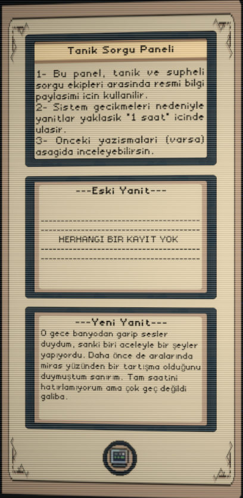

# 🔍 Project Suspicion

**Yapay Zeka Destekli Dedektiflik Simülasyonu**

---

## 🎮 Oyun Hakkında

**Project Suspicion**, klasik Cluedo kutu oyunundan ilham alan, **yapay zeka teknolojisi** ile güçlendirilmiş yenilikçi bir sorgulama oyunudur. Bir dedektif olarak, **LLM destekli katil karakterini** sorgulamaya çalışırsınız. Hedef basit: **X soru içinde** cinayetin **yerini**, **nedenini** ve **silahını** bulmak!

<div align="center">


</div>

## 🎮 Hemen Oynayın!

**Hazır mısınız?**

```
1. Dokümantasyonu okuyun ✅
2. Oyunu indirin 📦
3. Strateji belirleyin 🧠
4. Katili yakalayın! 🔍
```
- **İtch.io:** *Yakında Eklenecek*
- **v0.1.0:** [GitHub Releases Sayfası]

---

## ✨ Öne Çıkan Özellikler

### 🤖 Yapay Zeka Destekli Katil
Her oynanış tamamen farklı! **Google Gemini API** ile desteklenen katil karakteri:
- Gerçek zamanlı, tahmin edilemez yanıtlar verir
- Sorgulamanıza göre duyguları değişir
- Yalan söyler, alibi uydurur, hatta hata yapabilir!


### 🧠 Dinamik Duygu Sistemi
Katilin **5 duygusal parametresi** vardır ve her sorunuz bu duyguları etkiler:

| Duygu | Etki | Kritik Durum |
|-------|------|--------------|
| 😱 **Korku** | Yakalanma korkusu artar | %100: Ağlayıp susar |
| 😰 **Stres** | Baskı altında hata yapar | %100: Öfke patlaması |
| 😤 **Öfke** | Agresifleşir, küfreder | %100: Saldırgan olur |
| 🧊 **Soğukkanlılık** | Kontrolünü korur | %0: Tutarsız davranır |
| 😴 **Yorgunluk** | Mental olarak yorulur | %100: Uyuya kalır |

<div align="center">


</div>

### 💬 Tam Sorgulama Özgürlüğü
**Siz stratejinizi belirlersiniz:**

```
🤝 Nazik Yaklaşım:
"Sana yardım etmek istiyorum, doğruyu söylersen ceza indirimi alabiliriz."

💢 Agresif Baskı:
"YALAN SÖYLEME! Tanık seni gördü, itiraf et!"

🧠 Psikolojik Manipülasyon:
"Elimde kanıtlar var, en iyisi sen anlat..."

⚖️ Yasal Haklar:
"TC Anayasası'na göre susma hakkın var ama..."

🎭 Rol Yapmak: 
"Biraz sakinlemelisin (Gülümseyerek elini omzuna koyar ve paketinden sigara çıkartır.)"
"... (Sessizce bekler)"
```

### 🎲 Her Oyun Farklı
- **27 farklı cinayet kombinasyonu** (3×3×3)
- Rastgele oluşturulan **parametreler**
- Rastgele oluşturulan **görgü tanığı ifadeleri**
- LLM'in her seferinde **farklı hikaye anlatması**
- Sonsuz **yeniden oynanabilirlik**
---

## 🎯 Nasıl Oynanır?

### Adım 1: Tanık İfadesini Oku
Oyun başlarken bir **görgü tanığı ifadesi** alırsınız. Ancak dikkatli olun!
- ⚠️ Tanık %40-80 güvenilir
- 💭 "Sanırım...", "Galiba..." gibi belirsiz ifadeler kullanır
- 🎭 Bazen yanlış bilgi verebilir

<div align="center">



</div>

**Örnek Tanık İfadesi:**
> "O gece geç saatlerde bahçeden garip sesler duydum sanki. 
> Tam hatırlamıyorum ama tabanca sesi gibi bir şey vardı galiba..."

### Adım 2: Stratejinizi Belirleyin
Katili nasıl sorgulamak istiyorsunuz?
- 🤝 **Nazik**: Güven kazanın, rahatlatın
- 💢 **Agresif**: Baskı yapın, korkutun
- 🧠 **Manipülatif**: Yalan söyleyin, blöf yapın

### Adım 3: Katili Sorgulayın
Input field'a sorunuzu yazın ve "Sor" butonuna basın.

<div align="center">


</div>

**Katil yanıt verir:**
- 💬 Cevabını okuyun (yalan mı, doğru mu?)
- 📊 Duygularını izleyin (hangi duygu arttı?)
- 🔍 İpuçlarını not edin

<div align="center">


</div>

### Adım 4: İpuçlarını Toplayın
Her soru sonrası şunları analiz edin:
- ✅ Katil hangi parametreleri **reddetti**? (muhtemelen yanlışlar)
- ❌ Hangi parametrelerden **kaçındı**? (muhtemelen doğrular)
- ⚠️ **Hata yaptı mı**? (Stres ≥70% ise %50 ihtimal)
- 😰 **Duyguları nasıl?** (Çok korkuyorsa doğruya yaklaşıyorsunuz)

### Adım 5: Tahmin Edin
Elinizde yeterli ipucu topladığınızda:
1. Sağ panelden **3 parametreyi** seçin (Yer, Neden, Silah)
2. "Tahmin Et" butonuna basın
3. Sonucu öğrenin!

<div align="center">


</div>

---

## 🏆 Kazanma ve Kaybetme Koşulları

### ✅ Kazanma Yolları

#### 1️⃣ Mükemmel Tahmin
**3 parametreyi de doğru** bulursanız:
```
Katil: "Doğru tahmin ettin... Evet, intikam için yaptım.
        Mutfağa çağırdım onu. Bıçak ile... artık her şey bitti."

🎉 OYUN BİTTİ - KAZANDIN!
```

#### 2️⃣ Duygusal İtiraf
Katili **Soğukkanlılık %100** yaparsanız:
- Çok rahat hisseder
- Kendini ifşa eder
- İtiraf eder

### ❌ Kaybetme Yolları

#### 1️⃣ Yanlış Tahmin
**En az 1 parametreyi yanlış** tahmin ederseniz:
```
Katil: "Yanlış! Tamamen yanlış! Ben böyle bir şey yapmadım!
        Avukatım da geldi zaten, artık konuşmayacağım!"

💔 OYUN BİTTİ - KAYBETTİN!
```

#### 2️⃣ Duygusal Çöküş
Katili çok korkutur veya yorarsanız:

| Durum | Ne Olur? |
|-------|----------|
| 😱 **Korku %100** | Ağlayıp susar, konuşmaz |
| 😴 **Yorgunluk %100** | Uyuya kalır, cevap veremez |
| 😤 **Stres %100** | Öfke patlaması, saldırgan olur |

#### 3️⃣ Soru Hakkı Bitimi
10 soru içinde çözemezseniz oyun biter.

---

## 📊 Oynanış İstatistikleri

### Zorluk Seviyeleri

Oyunda **3 farklı katil tipi** vardır (henüz oyuncuya seçtirmiyoruz):

| Tip | Zorluk | Özellikler |
|-----|--------|------------|
| 🙂 **Saf** | Kolay | Duygusal, çabuk etkilenir, hızlı strese girer |
| 🤓 **Zeki** | Orta | Mantıklı, tutarlı yalanlar söyler, savunma kurar |
| 😈 **Psikopat** | Zor | Soğukkanlı, empati yok, çok zor korkutulur |

### Ortalama Oyun Süresi
- ⚡ **Hızlı Çözüm:** 3-5 dakika (5-6 soru)
- ⏱️ **Normal Çözüm:** 8-12 dakika (7-9 soru)
- 🐌 **Uzun Sorgulama:** 15+ dakika (tüm sorular)

---

## 🎨 Görsel Tasarım

### Retro/VHS Aesthetic
Oyun, **80'ler sorgu odası** atmosferini taşır:
- 📺 VHS efektleri ve scanline'lar
- 🎨 Kahverengi-bej renk paleti
- 📄 Eski kağıt doku efektleri
- 🔦 Film noir ışıklandırma

<div align="center">


</div>

### UI Tasarımı
- **Sol Panel:** Tanık ifadesi ve önceki yanıtlar
- **Orta Panel:** Katil iletişim ve duygu barları
- **Sağ Panel:** Şüpheli kelime listesi ve tahmin paneli

---

## 🎯 Stratejiler ve İpuçları

### 🧠 Başlangıç Stratejileri

#### Strateji 1: Nazik Dedektif
```
✅ Avantajları:
- Katil rahatlar (Soğukkanlılık ↑)
- Daha çok bilgi verir
- Hata yapma ihtimali artar

❌ Dezavantajları:
- Yavaş ilerleme
- Fazla rahat olursa manipüle edebilir
```

#### Strateji 2: Agresif Sorgucu
```
✅ Avantajları:
- Hızlı sonuç
- Korku/Stres yüksek → Hata ihtimali

❌ Dezavantajları:
- Çok agresifsen ağlar/susar
- Öfkelenir ve saldırganlaşır
```

#### Strateji 3: Dengeli Yaklaşım (Önerilen)
```
1. İlk 3 soru: Nazik (bilgi toplama)
2. Orta 4 soru: Baskı artır (test et)
3. Son 3 soru: Stratejik (doğruya odaklan)
```

### 🔍 İpucu Okuma Rehberi

**Katil ne zaman yalan söylüyor?**
- 👁️ Göz teması kaçırma
- 😰 Stres/Korku artışı
- 🗣️ Fazla detaylı açıklama (savunmaya geçme)
- ⚡ Hızlı cevap (önceden hazırlamış)

**Katil ne zaman doğru söylüyor?**
- 😌 Rahat duruş
- 🧊 Soğukkanlılık yüksek
- 📝 Kısa ve net cevap
- ✅ Kendinden emin ton

### 🎲 Gelişmiş Taktikler

#### Taktik 1: Yanlış Bilgi Testi
```
Oyuncu: "Tanık seni bahçede gördü!"
Katil: "Bahçe mi? Hayır, ben bahçeye gitmedim!"

→ Bahçe'yi kesin olarak reddetti = Muhtemelen yanlış parametre
```

#### Taktik 2: Stres Tetikleyici
```
Stresi %70'e çıkar, sonra kritik soru sor:

Oyuncu: "Peki mutfakta ne yapıyordun?"
Katil: "Mutfakta- HAYİR, mutfakta değildim!"

→ HATA YAPTI! Mutfak doğru yer olabilir
```

#### Taktik 3: Çapraz Sorgulama
```
1. Soru 2'de: "Nerede olduğunu söyle"
2. Soru 5'te: "2. soruda ne demiştin?"

→ Tutarsızlık yakalamaya çalış
```

---

## 📚 Detaylı Dokümantasyon

### 🎮 Oyun Tasarımı
- 📖 [Demo GDD (Game Design Document)](Docs/GDD/Demo-GDD/README.md)
- 📖 [Ana GDD (Game Design Document)](Docs/GDD/Main-GDD/README.MD)

### 📊 Raporlar
- 📈 [MVP Raporu](Docs/Reports/MVP-Report/README.md)
- 🚀 [v0.1.0 Release Notları](Docs/Reports/v0.1.0-Report/README.md)

---

## 🛠️ Sistem Gereksinimleri
- **Internet:** Gemini API için gerekli
---

## 📦 İndirme ve Kurulum

### GitHub Releases
```
🔗 Latest Release: v0.1.0
📅 Release Date: 10.10.2025
📦 Download: [GitHub Releases Sayfası]
```

### Kurulum Adımları
1. **İndirin:** Release sayfasından zip dosyasını indirin
2. **Çıkarın:** Zip'i istediğiniz klasöre çıkarın
3. **Çalıştırın:** `ProjectSuspicion.exe` dosyasını açın
4. **API Key:** Ayarlardan Gemini API key'inizi girin (v.0.2.0'dan sonra - Proje default olarak bir Keye sahiptir fakat bu Keyi kullanmanız önerilmez.)

```
=========================================================
Google Gemini API Ucretsiz Key Alma Adimlari
=========================================================

Gereksinimler
- Gecerli bir Google (Gmail) hesabi.

Adimlar
1.  **Web Sitesine Gidin:**
    Internet tarayicinizi acin ve asagidaki adrese gidin:
    https://aistudio.google.com/

2.  **Giris Yapin:**
    Sayfanin sag ust kosesinde bulunan "Sign In" veya "Giris Yap" butonuna tiklayarak Google hesabinizla giris yapin. Eger daha once giris yaptiysaniz bu adimi atlayabilirsiniz.

3.  **Sartlari Onaylayin:**
    Ilk kez giris yapiyorsaniz karsiniza cikacak olan hizmet sartlarini (Terms of Service) okuyup onaylayin.

4.  **API Anahtari Butonunu Bulun:**
    Giris yaptiktan sonra karsiniza gelen Google AI Studio arayuzunde, sol taraftaki menude veya sayfanin ust kisminda bulunan "< > Get API key" (API Anahtari Al) secenegine tiklayin.

5.  **Yeni Anahtar Olusturun:**
    Acilan "API keys" (API anahtarlari) penceresinde, "+ Create API key in new project" (Yeni projede API anahtari olustur) butonuna tiklayin. Google sizin icin otomatik olarak bir proje olusturacaktir.

6.  **Anahtari Kopyalayin:**
    Bir anlik bir bekleyisin ardindan ekranda uzun bir karakter dizisinden olusan API anahtariniz belirecektir. Yanindaki kopyalama ikonuna tiklayarak anahtari panonuza kopyalayin.

7.  **Anahtari Guvenle Saklayin:**
    Kopyaladiginiz bu API anahtarini bilgisayarinizda guvenli bir metin dosyasina veya bir sifre yoneticisine kaydedin. Bu anahtar size ozeldir ve bir sifre gibi korunmalidir.
```

---

## 🔄 Versiyon Geçmişi

| Versiyon | Tarih | Özellikler | Durum |
|----------|-------|------------|-------|
| MVP | 02-03.01.2025 | MVP mekanik test | ✅ [Repo](https://github.com/EthemEmreOzkan/02-Unity-Project_Suspicion-MVP/tree/main) |
| **v0.1.0** | 07-10.01.2025 | İlk oynanabilir prototip | ✅ [Yayında]() |
| v0.2.0 | TBD | Ana menü, oyun sonu ekranları, ayarlar, saat mekaniği| 🚧 Geliştirmede |
| v0.3.0 | TBD | Ses efektleri, animasyonlar | 📅 Planlandı |
| v1.0.0 | TBD | İlk stabil release | 🎯 Hedef |

**v0.1.0 Özellikleri:**
- ✅ LLM entegrasyonu (Gemini API)
- ✅ 5 parametreli duygu sistemi
- ✅ Sorgulama mekaniği
- ✅ Görgü tanığı sistemi
- ✅ Tahmin mekaniği
- ✅ Türkçe dil desteği

**v0.2.0'da Gelecekler:**
- 🔜 Ana menü
- 🔜 Oyun sonu ekranları
- 🔜 Ayarlar menüsü
- 🔜 Bireysel Api key kullanımı

---

## 🤝 Katkıda Bulunma

Bu proje açık kaynak değildir ama **geri bildirimlerinizi** bekliyorum!

### Bug Raporu
Bir hata buldunuz mu?
1. [GitHub Issues](https://github.com/EthemEmreOzkan/02-Unity-Project_Suspicion-Prototype/issues) açın
2. Hatayı detaylıca açıklayın
3. Ekran görüntüsü ekleyin (varsa)

---

## 📧 İletişim

**Geliştirici:** Ethem Emre Özkan

- 📧 **Email:** ethememreozkan@gmail.com
- 🐙 **GitHub:** [@EthemEmreOzkan](https://github.com/EthemEmreOzkan)
- 🎮 **itch.io:** [saisol](https://saisol.itch.io)

---

## 📄 Lisans

Bu projenin tüm hakları saklıdır. Lisans detayları için lütfen aşağıdaki dosyayı inceleyin:

- 📜 **[LICENSE.md](LICENSE.md)**

**Kısaca:**
- ❌ Bu projenin kodlarını veya varlıklarını izinsiz olarak kopyalayamaz, dağıtamaz veya ticari olarak kullanamazsınız.
- ✅ Projeyi indirip oynamakta özgürsünüz.
- 👨‍⚖️ Tüm haklar geliştirici **Ethem Emre Özkan**'a aittir.

---

## 🙏 Teşekkürler

Bu projeyi mümkün kılan:
- **Cluedo Board Game** - İlham kaynağı
- **Disco Elysium** - İlham kaynağı
- **Google Gemini API** - AI teknolojisi

---

<div align="center">

**⭐ Projeyi beğendiyseniz yıldız vermeyi unutmayın!**

[⬆️ Başa Dön](#-project-suspicion)

</div>

---

>**Not**: 07.10.2025 tarihinde başladığım bu proje 10.10.2025 tarihinde v0.1.0 yayınlanmıştır.

> **Son Güncelleme:** 10.10.2025  
> **Dokümantasyon Versiyonu:** 1.0  
> **Oyun Versiyonu:** v0.1.0
